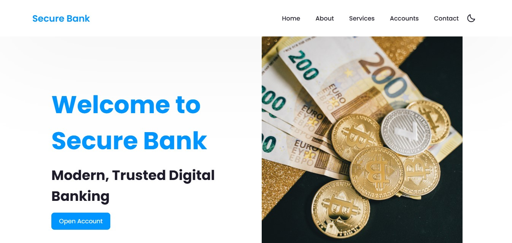

<h2 align="center">
  SecureBank
</h2>

  

- [Link to Project Repository](https://vilhem-2004.github.io/SecureBank/)
- [Demo Link](https://vilhem-2004.github.io/SecureBank/SecureBank/)

## Table of Contents

- [Introduction](#introduction)
- [Features](#features)
- [Usage](#usage)
  
## Introduction

Welcome to the SmartBank Landing Page! This modern and professional landing page highlights the key features of SmartBank, a secure and user-friendly digital banking solution. It's built using HTML, CSS, and JavaScript to deliver a responsive and interactive user experience.

## Features

- Informative sections introducing key areas including Home, About Us, Accounts, Services, Security, Support, and Contact.

- Fully responsive design, optimized for mobile, tablet, and desktop views.

- Light and Dark mode toggle for accessibility and user preference.

- Scroll animations for a smooth, modern browsing experience.

## Usage

1. To explore the SmartBank Landing Page:

2. Clone or download the repository to your local machine.

3. Open the index.html file in your web browser.

4. Navigate through sections using the navigation bar links.

5. Try the dark mode toggle and see how the layout adjusts across devices.

6. You can easily customize the content, colors, or branding elements to suit your specific banking product or institution.

## Show your support

If you find this banking landing page helpful or inspiring, consider giving it a ⭐️ on GitHub! Your support helps improve and maintain open-source financial UI projects like this one.
